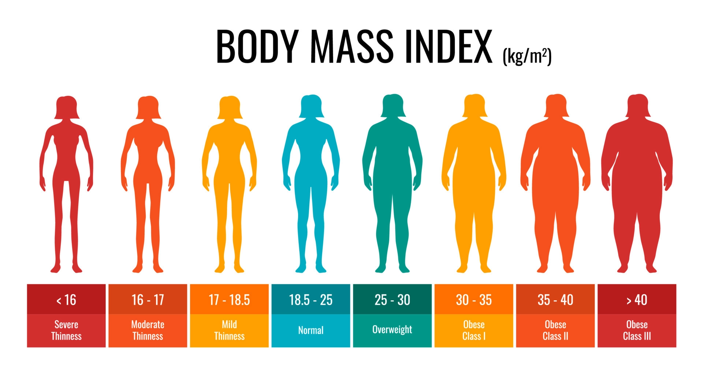

# BMI-Calculator-
The body mass index (BMI) is a measure that uses your height and weight to work out if your weight is healthy. The BMI calculation divides an adult's weight in kilograms by their height in metres squared. For example, A BMI of 25 means 25kg/m2.
#  What’s a Healthy BMI in Adults? Here’s Everything You Need to Know

  
  
# BMI was invented in the 1830s and it seems to have outgrown its utility
Based on your measurements, she may have told you that you wanted to be "in the green," meaning you were considered a healthy weight based on your height. If your measurements landed you in a blue square, you were likely underweight, and if you landed in a yellow, orange, or red square, you were likely overweight.
